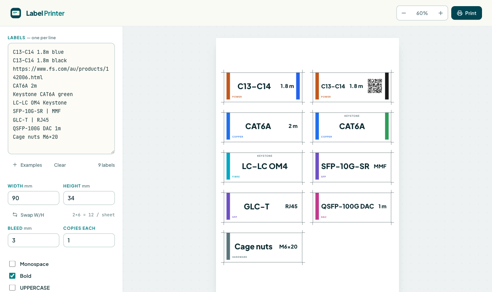

# Label Printer

A tiny, client-side tool for printing **cut-out labels onto A4 paper** — sized for the
34 × 90 mm slots on the storage bins (e.g. sorting cables: `C13–C14 1.8m`).

**Live demo: https://topherr.github.io/label-printer/**

Type one label per line, watch the live A4 preview lay them out multi-up, then print
straight from the browser. Each label uses a **shelf-scan** layout — a family colour bar on
the left, a big centred headline with the size/spec pinned on its right-hand eye-line, a
small family tag bottom-left, and a jacket-colour stripe on the right — so a wall of bins is
fast to scan. Every label gets a **solid cut outline and a bleed gutter** so they cut out
cleanly; the cut lines are borders, so they print without the browser's "Background
graphics" option.



## How a line is read

Each line auto-detects a **category family** (which sets the colour) from keywords, pulls a
metre length / fastener size into the chip, and turns a trailing colour word into a swatch:

| You type | Type shown | Family · colour | Chip / swatch |
|----------|-----------|-----------------|------|
| `C13–C14 1.8m blue` | C13–C14 | POWER · amber (IEC / `Cxx` / plug / mains) | 1.8 m + 🔵 |
| `CAT6A 2m` | CAT6A | COPPER · blue (CAT / RJ45 / keystone) | 2 m |
| `Keystone CAT6A green` | **CAT6A** (eyebrow *Keystone*) | COPPER · blue | 🟢 |
| `LC–LC OM4 Keystone` | **LC–LC OM4** (eyebrow *Keystone*) | FIBRE · aqua (LC / SC / `OMx` / fibre) | — |
| `SFP-10G-SR \| MMF` | SFP-10G-SR | SFP · violet (SFP / QSFP / GLC / `n`GBASE) | MMF |
| `QSFP-100G DAC 1m` | QSFP-100G DAC | DAC · magenta (DAC / twinax / `CUn`) | 1 m |
| `Cage nuts M6×20` | Cage nuts | HARDWARE · slate (anything else) | M6×20 |

Notes:

- **Headline vs size:** the headline (type) and the size/spec read as two co-equal anchors —
  the headline is size-capped so short codes don't balloon, and the size is pinned large on
  its right-hand eye-line.
- **Descriptor words** (`keystone`, `coupler`, `adapter`, `faceplate`, …) are pulled out of
  the headline and shown as a small uppercase **eyebrow above it**, so `Keystone CAT6A` →
  headline **CAT6A** with a `KEYSTONE` eyebrow.
- **Family order** is DAC → SFP → fibre → copper → power, so an SFP/QSFP module (which
  mentions LC or RJ45) lands in SFP, and a twinax cable (which mentions QSFP) lands in DAC.
- **Jacket colour:** put the item's physical colour *last* (`… black`) and it becomes a
  full-height **stripe on the right edge** — handy for "grab the blue 2 m", the black keystone
  vs the green one, blue vs black IEC leads, etc. So the **left bar = what it is** (family) and
  the **right stripe = which colour** (variant). Needs "Background graphics" on when printing.
- **Size / spec** shows in the bottom-right of the label (`1.8m` length, `M6×20` fastener
  size, or your own via `name | spec`). A transceiver's reach (SFP `300m`) and part numbers
  (`CU1M`, `OM4`, `20mm`) are *not* mistaken for a length.
- Keep labels **concise** — the type is the search key, so `SFP-10G-SR`, not the full
  marketing line. If a colour comes out wrong, tweak the wording (keywords live in
  `classify()` in `js/app.js`).
- **Slot safe-margin:** content keeps a 3mm clear zone at each end (the bit hidden by the
  bin-slot lip), so nothing important slides under the slot. Change it via `SAFE` in `app.js`.
- **QR codes:** put a `http(s)://…` URL on the line (e.g. the FS.com product page) and it
  renders as a QR on the right — scan it for the datasheet / reorder page. Example:
  `C13–C14 1.8m black https://www.fs.com/au/products/142006.html`.

## Run it

The hosted version is at **https://topherr.github.io/label-printer/** — nothing to install.

To run locally:

```bash
docker compose up
```

Then open <http://localhost:8084>. It's a static app (plain HTML/CSS/JS, no build step), so
you can also just open `frontend/index.html` in a browser.

## Printing true-size

The on-screen preview is rendered in real millimetres, so it matches paper exactly.
When you print:

1. Click **Print** (or `⌘P` / `Ctrl-P`).
2. Choose **A4**.
3. Set **Margins → None** and **Scale → 100%** (turn *off* "Fit to page").

That guarantees a 90 mm label measures 90 mm on the page. The control panel and toolbar
are hidden in print — only the sheets come out.

## Controls

| Control | What it does |
|---------|--------------|
| **Labels** | One label per line. Family colour + length chip are auto-detected; force a chip with `primary \| chip`. |
| **Examples** | Drops in sample labels covering all four families. |
| **Width / Height** | Label trim size in mm (default 90 × 34). **Swap W/H** rotates. |
| **Bleed** | Extra margin around each label (the cutting gutter). Cut ticks sit in it. |
| **Copies each** | Repeat every label N times (handy to fill a sheet). |
| **Monospace / Bold / UPPERCASE** | Styling for the big type line. |
| **Label border** | Draw a thin rounded border on each label. |
| **Cut lines** | Solid outline on the trim edge (with corner ticks) showing where to cut. |

Everything you type and every setting is saved in your browser automatically.

## Tech / deployment

- `frontend/` — `index.html` + `css/main.css` + `js/app.js`. The only third-party file is
  `js/qrcode.js` (qrcode-generator, MIT) — vendored locally so QR codes work offline.
- `docker-compose.yml` serves it via nginx on port **8084**.
- Layout uses real `mm` CSS units with a `@page { size: A4; margin: 0 }` print rule;
  the preview is the same DOM, just scaled with a CSS transform for the screen.
- **GitHub Pages:** `.github/workflows/pages.yml` publishes `frontend/` on every push to
  `main`. Pages must be set to deploy from **GitHub Actions** (Settings → Pages → Source).

## License

MIT — see [LICENSE](LICENSE). Bundles [qrcode-generator](https://github.com/kazuhikoarase/qrcode-generator)
(MIT) for client-side QR rendering.
